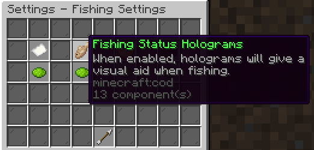

## Fabric version
This is the superior version of the mod.
It includes a mod menu using [YACL](https://modrinth.com/mod/yacl), which is much easier to use than the chat-based approach the forge-subproject took.  
This makes it a **REQUIRED** dependency (currently version *3.7.1+1.21.5-fabric* and up).

### Requirements
- [YACL](https://modrinth.com/mod/yacl), version *3.7.1+1.21.5-fabric* and up
- Fishing: Enabling the "Fishing Status Holograms" option in the following path: "Skyblock Menu" -> "Settings" -> "Personal" -> "Fishing Settings".

### Important Information
This version does have some caveats:

- **Out-of-sync with forge**: Many APIs are incompatible between forge and fabric and some features are impossible with hypixel's 1.21.5 rework. Currently, only fishing is supported!
  - For example: The sound implementation, which the forge version uses, is incompatible due to the sound being missing on hypixel's end. It is being kept there to ensure compatibility, in case it gets added in the future.

### How to use
Every configuration can be accessed through either the ``/hqol`` command or the [ModMenu](https://modrinth.com/mod/modmenu) entry.  
It does not have any keybindings in its current state - they will be added later on.

Entries with sliders, that have two thumbs, are value ranges. When needed, a number inside the range will be randomly generated.
